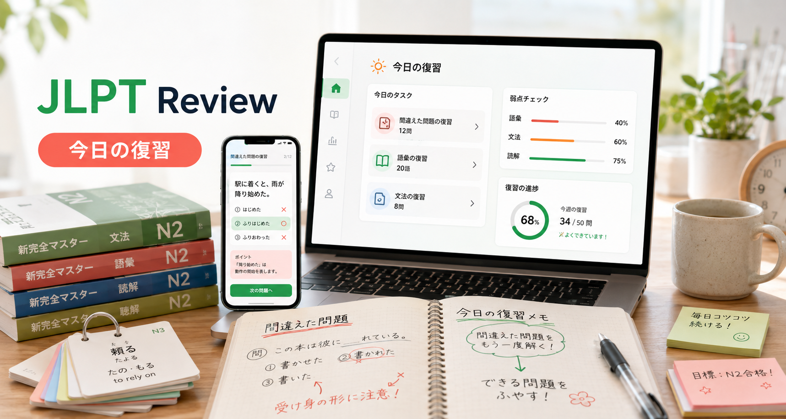

# JLPT Master Deck

JLPT Master Deck は、JLPT の問題、間違い、分からない単語、文法メモ、読解文、聴解の難所を、実行しやすい復習サイクルにまとめるローカルファーストの学習ワークスペースです。

英語版がデフォルトの README です。英語版は [README.md](README.md) を参照してください。



## できること

- 単語、文法、例文、読解、聴解の素材を一つの受け取り箱に集約できます。
- 学習計画、解答履歴、正答率、弱点から、毎日の復習タスクを作成できます。
- 語彙、文法、読解、聴解、総合演習、会話、意見表現、模擬試験に対応しています。
- 正誤判定、文脈、解説、選択肢ごとの分析、記憶ポイント、ふりがなを確認できます。
- 間違い、履歴、達成状況、正答率、学習時間、復習間隔を記録できます。
- 公式 N1 の出題区分をもとにした、編集可能な問題形式ガイドを備えています。
- ローカル音声、個人メモ、復習ドラフト、多言語の学習者向けデータに対応しています。
- MCP/Agent と連携し、学習素材の登録、ドラフト作成、弱点分析、学習計画の更新を自動化できます。

## 設計方針

- **ローカルファースト:** アカウント、進捗、入力素材、ドラフト、計画、復習スケジュールはローカル SQLite に保存します。
- **自動化の前に確認:** AI 生成コンテンツは、確認が終わるまで生成済み・未検証として表示します。
- **段階的な情報表示:** 一覧ページは簡潔にし、解説、編集、履歴、複雑な操作は詳細ページに分けています。
- **データの分離:** 公開用の初期データを更新しても、学習者の個人進捗は上書きされません。

## クイックスタート

必要環境: Node.js `22.13.0` 以上。

```bash
npm install
npm run dev
```

<http://localhost:4220/> を開いてください。ローカル API は <http://127.0.0.1:4221/> で起動します（`JLPT_WEB_PORT` / `JLPT_API_PORT` で変更可）。ログイン画面で作成したユーザー名とパスワードは、このマシンに保存されます。

```bash
npm run build       # フロントエンドと MCP アプリをビルド
npm run lint        # ESLint を実行
npm run dev:tunnel  # 任意: Cloudflare Tunnel でプレビュー
```

## MCP と Agent

- `skills/jlpt-chat-review/` — 学習者のメモを MCP ツールで知識項目と審査済みの問題に整理します。
- `skills/jlpt-study-generator/` — 個人メモがない場合に、一般的な学習計画と最初の練習ドラフトを保存します。

プロジェクト専用の MCP サーバーは次のコマンドで設定できます。

```bash
npm run mcp:setup
```

設定後に Codex を再起動し、`jlpt_review` が利用可能か確認してください。HTTP MCP エンドポイントは OAuth 2.1 で保護されています。アプリの同意フローで認証し、Agent に個人データへのアクセスを許可してください。MCP サーバーには個別の `login` ツールはありません。

基本的な流れは、素材を登録し、MCP で学習記録を分析してドラフトを作成し、アプリで確認・コメントした後、審査を通った問題を練習として公開することです。

Agent が書いた内容はすべて「AI が作成・未確認」として保存されます。公式 JLPT 素材ではないため、利用前に確認してください。

## データとプライバシー

個人データは次に保存されます。

```text
.local/jlpt-v3.sqlite
.local/v3-media/<user-id>/
```

v3 データベース（設計：[docs/schema-v3-design.ja.md](docs/schema-v3-design.ja.md)）には、アカウント、設定、単語帳、知識項目、問題集、練習記録、復習スケジュール、ドラフト、計画、日報、受信箱が保存されます。画像と音声は SQLite と Git の外に置きます。v3 より前のデータベース（`.local/jlpt.sqlite`）があれば、初回起動時に新しい v3 ファイルへ移行します（旧ファイルは読むだけです）。

復習スケジュールは簡略化した Anki/SM-2 方式です。正解すると間隔が延び、不正解の場合は短期間の復習に戻り、易しさ係数が下がります。

詳細は [docs/local-backend-mcp.md](docs/local-backend-mcp.md) を参照してください。

## Cloudflare Pages

- フレームワーク: `Vite`
- ビルドコマンド: `npm run build`
- 出力ディレクトリ: `dist`
- Node.js: `22.13.0` 以上

デプロイ前に [docs/cloudflare-pages-deploy.md](docs/cloudflare-pages-deploy.md) を確認してください。ローカルビルド、Tunnel プレビュー、本番デプロイは別々の検証範囲です。

## プロジェクト構成

- `src/features/` — 学習者向けのページとワークフロー
- `src/domain/` — 復習、問題、記憶、学習計画のロジック
- `src/i18n/` — UI 翻訳とローカライズ文言
- `server/` — ローカル API、保存処理、MCP サーバー
- `cloudflare/` — Cloudflare Worker/API の実装とテスト
- `skills/` — Codex 対応の学習ワークフロー
- `docs/` — デザイン、バックエンド、MCP、デプロイの資料

画面構成とレビュー基準は [docs/ui-design-guidelines.md](docs/ui-design-guidelines.md) を参照してください。

## ライセンス

Copyright © 2026 Itsuki. All rights reserved.

本リポジトリは確認と個人利用のために公開しています。現時点ではオープンソースライセンスを付与していません。

連絡先: [@itsuki_maer](https://x.com/itsuki_maer) · [jlpt@erzhiqian.cc](mailto:jlpt@erzhiqian.cc)
