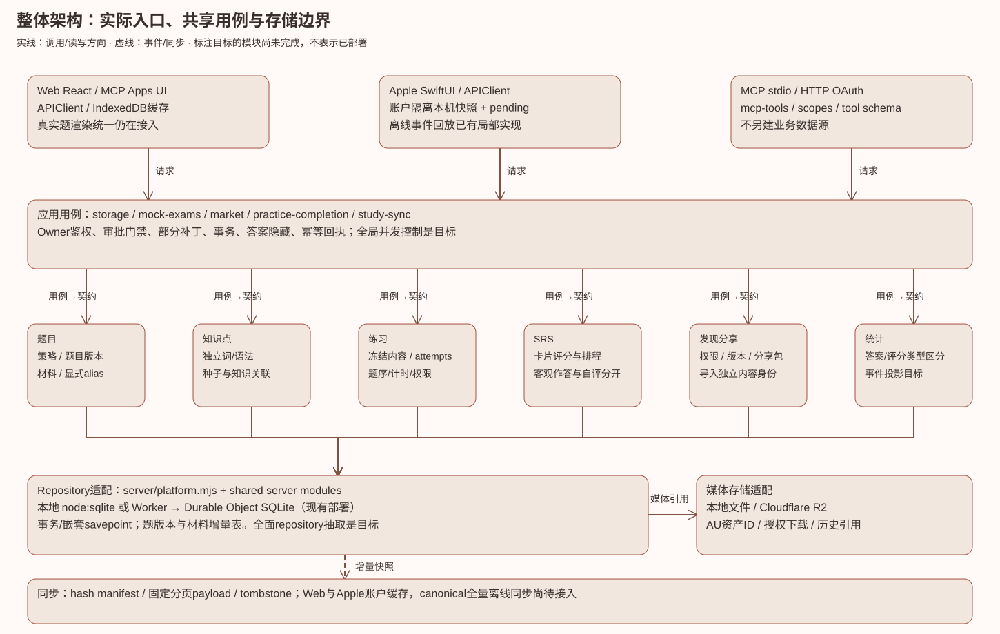
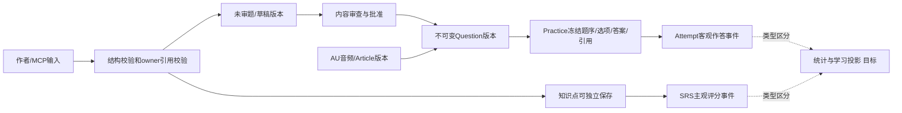
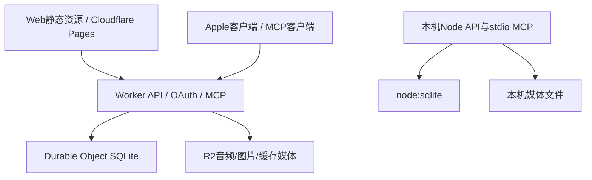

# JLPT Master Deck 整体架构

> **已被 schema v3 取代。** 本文描述 v3 之前的数据模型或接口，保留作历史参考。当前结构见 [schema-v3-design.md](schema-v3-design.md)，接口与 MCP 见 [local-backend-mcp.md](local-backend-mcp.md)。

2026-10-07；本文对应本地domain/unified-question-bank分支，不代表部署状态。原始方向：[统一题库方案](unified-question-bank-design.md)。领域边界：[领域模型](domain-model.md)；详细契约：[知识点](knowledge-content-contracts.md)、[23题型](question-type-specifications.md)、[MCP](mcp-domain-contracts.md)、[迁移计划](data-migration-plan.md)、[UI入口/状态矩阵](question-experience-matrix.md)。

图的可维护源：[JSON](diagrams/architecture-layers.json)，渲染脚本：[render-domain.py](diagrams/render-domain.py)。六领域是业务边界，不是六张表或六个服务；现项目保持单体共享业务模块，不引入新技术栈。

## 请求路径与依赖

Web React与嵌入式MCP Apps经APIClient请求HTTP API；Apple SwiftUI经apple/Sources/APIClient.swift走相同账户API；MCP stdio或HTTP OAuth由server/mcp-tools.mjs映射同一业务函数。server/api-handler.mjs与MCP负责协议/鉴权，应用函数检查owner、审批、引用与事务，再用领域策略处理内容。平台适配只能实现存储能力，不应反向决定题型规则。

现有业务函数大量仍位于server/storage.mjs，并非已完成六领域目录重构。server/question-bank.mjs、bank-materials.mjs与src/domain/questionContract.mjs形成增量核心；其余逻辑逐步从旧storage抽出。MCP不另写一套题库，Apple不凭本机累计快照覆盖服务器事件。

## 模块归属与当前状态

|边界|现有模块/责任|本次状态与后续|
|---|---|---|
|题目|questionContract、question-bank、bank-materials、reading-schema、listening storage|23策略/别名；版本、alias、材料/题组已接主写入口。完整各型结构校验与审批策略待补。|
|知识点|item-schema、vocab-seeds、storage item upsert、domain/questions|独立保存与适用题；种子适配canonical。义项实体、全多对多关系编辑待补。|
|练习|storage daily/topic/draft、mock-exams、practice-completion|旧ID/答案/attempt保留；批准后发布门禁；快照追加canonical引用。所有历史反填、抽组策略与统一呈现仍需继续。|
|SRS|card review/history、storage progress、Apple pending|评分去重已有；评分与客观答题的完整统一事件投影待补，不能宣称全端收敛。|
|发现分享|market、market-media、visibility、package import|沿用发布权限和独立导入；新增题/种子接核心。统一分享版本/关系/删除恢复尚未完成。|
|统计|daily-summary、weak points、study-sync-status|旧接口继续兼容；全面稳定事件/自然日与滚动窗口投影待实施。|
|UI|React各Panel、QuestionOptions、SwiftUI views、MCP Apps|选项组件已有真实复用；完整QuestionRenderer及跨模式/状态渲染仍待实现；设计图是概念。|
|同步|study-sync、Web IndexedDB、LocalStudyData、pending queue|分页manifest/tombstone与原生答题replay已有；新canonical表的完整同步和离线消费待补。|

## 数据流：材料、题目、练习与作答

题目主身份由owner与显式source identity/alias决定，不按stem合并。版本保存固定选项ID；旧answerIndex保持0-based。旧draft数字answer要显式base。同AU多LS通过材料引用，文章共享由明确ref，不重复复制资源。材料变化生成新版本；源题更新不会修改旧练习snapshot。显式修改某练习只修改该练习版本，既有答案和其他题不被重写。

草稿归档保留原材料上下文并unscored；不能因满足结构就进入正式题池。练习练习生成旧直接入口与draft审批入口不同，不能用新的设计文案假装全部已有审批流程。

## 部署视图与事务

云端路径依据cloudflare/api-worker.mjs及wrangler.api.json；shared server通过AsyncLocalStorage platform适配SQLite和媒体读写。云请求外层有Durable Object事务，本地transaction支持嵌套savepoint，不能在内层commit提前提交外层。不同owner引用一律拒绝。音频bytes写入与SQLite不承诺跨服务原子性；失败清理/队列回收需保留真实结果，历史引用阻止误删。

## 同步、投影、权限

现有下载以每条内容哈希构建manifest，固定分页payload，最后提交cursor，删除以tombstone传播。新canonical题/材料/组必须一起入本机可持久集合，消费者支持完成之前不能只推进cursor忽略未知集合。原生pending先保存事件再推进题，重试使用稳定eventId。完整设计见[多端同步](multi-device-study-sync-architecture.md)，其中旧现状须以最新代码核对。

作答与自评分开：selected客观结果及unanswered不能变成forgot/hard；评分影响SRS排程，未答不计错。自然日按明确账户时区边界，滚动24小时独立参数。已接类型化learning_events、冻结版本作答校验、日总结事件投影、SRS新评分分离和Web批量draft/提交门禁；旧快照协议仍兼容，全面统计repository和统一事件投影仍是图中的目标。

答案权限来自练习容器与用例：考试未交卷隐藏答案/解析/转录/翻译；回看使用当时snapshot；作者编辑可以读完整内容但必须持library:write。分享visibility、owner和授权下载沿用server规则；导入不能复用他人私有引用或伪造owner。

## 迁移、回滚与验证

1. 先增量schema与适配层，保留旧表/旧ID/旧接口；读写主入口接新核心；不全库原地改ID。
2. 历史反填先在明确指定的本地副本dry-run，报告拒绝项、歧义numeric、alias和材料；未审内容保持needs_review。当前未提供完整生产迁移。
3. 接真实UI消费者、同步离线与事件写入；升级兼容字段可选，旧客户端继续读旧snapshot。
4. 再做统计/分享版本与统一并发/幂等；通过回归才可讨论移除适配。

回滚应用代码保留新增表和旧字段；旧客户端忽略可选canonical引用。不得删除旧answers、attempt、SRS或资产。新版本历史留存不能视为普通删除恢复已实现。DDL增加本身不删除用户数据；任何生产迁移/清理仍需明确审批。

测试分层：纯策略答案base/适用等级；SQLite版本/alias/owner/事务；MCP与REST同入口；材料共享与旧snapshot；Web交互权限/长内容/暂停恢复；原生bundle兼容及Swift解析；Cloudflare本地runtime；全库node --test、tsc、lint、Web及三MCP构建。没有真实设备/浏览器运行证据时不写“跨端UI验证完成”。阶段结果详见[实施证据](qa/domain-model-implementation.md)。本次不push/PR/merge/deploy，不访问生产数据或自动化。
