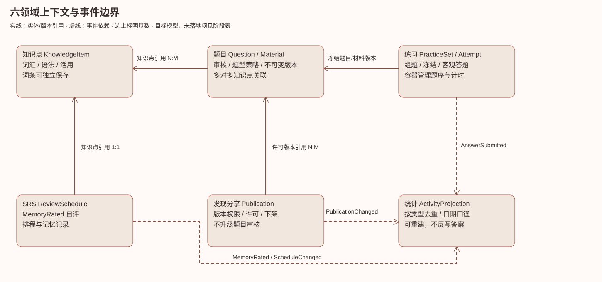
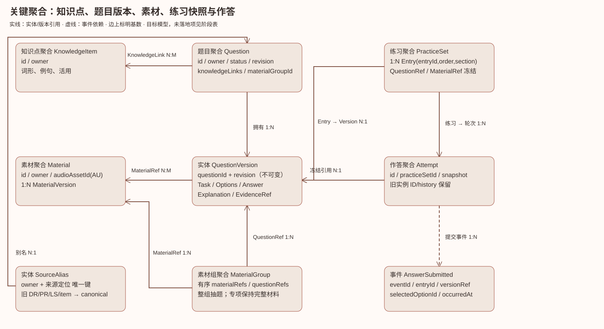
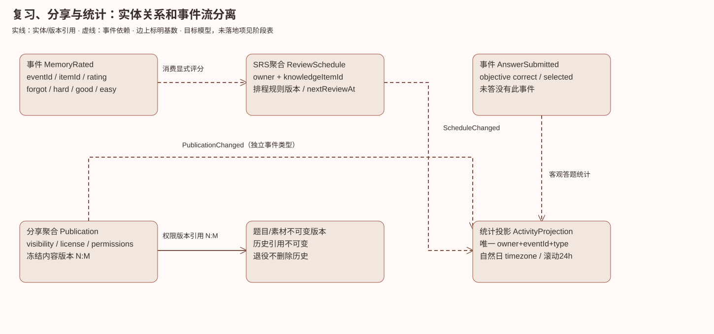

# JLPT 统一领域模型与渐进实施

2026-10-07；基于 main 的 unified-question-bank-design.md 与当前源码。本文是实施契约，生产迁移和发布未授权。独立工作区与分支 domain/unified-question-bank，不读取或改写其他工作区数据库。

## 边界与统一语言

|领域|聚合根/责任|依赖|
|---|---|---|
|题目|Question、Material、MaterialGroup；作者内容、审核、版本与题型策略|引用知识点 ID，不拥有词条|
|知识点|KnowledgeItem（现有 item ID；word/grammar）；词形、接续、例句|题目关联非必填；账户题型偏好属于练习生成|
|SRS|ReviewSchedule（owner+knowledgeItemId）、ReviewEvent；记忆自评与到期|消费显式记忆评分，不将未答转换为错|
|发现分享|Publication；授权、许可、内容版本、下架|引用冻结版本；不能自行提升题目审核状态|
|统计|可重建 ActivityProjection；答题、复习、学习日期|消费事件；不反写正确答案或排程|
|练习|PracticeSet、Attempt；编排、发布快照、答题|只引用题目版本和材料，删除组合不删原题|

不是六张表：题目/素材各有版本和关系，练习拥有条目及轮次；统计为投影。现有存储先经适配使用这些契约，逐步替代内嵌权威数据，不一次重写。

## 精确 taxonomy

旧 kind 保留为兼容别名，正式 ID 沿用 src/data/questionTypes.ts；补齐跨等级类型。未知分类不得猜测。

|正式 ID|名称|旧 kind|适用等级|
|---|---|---|---|
|vocabulary-kanji-reading|漢字読み|kanji_to_kana|N1–N5|
|vocabulary-orthography|表記|kana_to_kanji|N2–N5|
|vocabulary-word-formation|語形成|word_formation|N2（N3 为补充训练）|
|vocabulary-context|文脈規定|moji_goi|N1–N5|
|vocabulary-paraphrase|言い換え類義|meaning|N1–N5|
|vocabulary-usage|用法|usage|N1–N3|
|grammar-form|文法形式の判断|grammar|N1–N5（旧泛型仅兼容形式判断，不声称已审核）|
|grammar-composition|文の組み立て|文の組み立て|N1–N5|
|grammar-text|文章の文法|显式新增类型|N1–N5|
|reading-short|内容理解（短文）|显式 questionTypeId|N1–N5|
|reading-mid|内容理解（中文）|同上|N1–N5|
|reading-long|内容理解（長文）|同上|N1、N3|
|reading-integrated|統合理解|同上|N1、N2|
|reading-thematic|主張理解（長文）|同上|N1、N2|
|reading-information|情報検索|同上|N1–N5|
|reading-basic-training|基础训练|未分类 reading|非官方；等级未知 null|
|listening-task|課題理解|listening-task|N1–N5|
|listening-points|ポイント理解|listening-points|N1–N5|
|listening-outline|概要理解|listening-outline|N1–N3|
|listening-expression|発話表現|补齐，用户未列此项|N3–N5|
|listening-quick|即時応答|listening-quick|N1–N5|
|listening-integrated|統合理解|listening-integrated|N1、N2|
|listening-basic-training|基础训练|项目现有 basic-training 别名需逐接口保留|非官方；自由回答支持|

官方依据沿用方案文档的 JLPT 构成链接。技能标签（指示语、因果等）与题型、教材来源分开。表記/语形成不适用 N1；纯片假名和专名不强制六种。正式矩阵不得由 N1 UI 列表推导。长度不是阅读分类依据。

## 身份、版本、payload 与策略

Question 聚合保存 owner、稳定 id、revision、status(draft/needs_review/ready/retired)、origin、level|null、questionTypeId、knowledgeLinks、materialGroupId；Version 保存不可变内容和审核证据。引用值对象为 {id, revision}，禁止用 URL 或显示 AU/LS/DR/PR 编号当数据库身份。旧 ID/history 不改；Alias 的键为 owner+sourceKind+sourceId+sourceQuestionId，值为 canonicalQuestionId+revision。内容指纹仅产生候选，不凭同 stem 自动合并；复制来源一致且内容匹配才复用版本。

共同 payload：task{instructionKey,instructionParameters,target,conditions,stem}、options[{id,text|audioSegment}]、answer、explanation、materialRefs、annotations。通用说明由呈现层翻译，但目标词、★位置、否定条件、人物限制始终属于内容。保留 legacy snapshot 供旧 Web/native 渲染。

- 单选 answer={type:'single',optionId}；自由回答={type:'free',acceptedAnswers,normalizationPolicy} 或 unscored；排列含 fragments、starPosition、完整顺序证据；篇章语法含 blankId 与文章引用。
- 解析={summary,optionReasons:[{optionId,reason,evidenceRefs}],strategyKey,knowledgeRefs}；逐选项理由、正确答案和证据分开。策略注册表各 kind 持有校验、解析模板、解题技巧、材料要求及适用等级；共享基本单选校验不代替题型语义审核。
- 旧 answerIndex 明确 0-based；旧数值 answer 的 base 必须由来源契约提供，未知拒绝猜测。文字 answer 按原选项定位；重复文字歧义拒绝。DR947 修正结果不再次偏移。转换后保持选项顺序、原 answerIndex 和选项 ID。
- ready 与 strictExamEligible 分离：可练习旧题不自动成为正式模拟候选；审核命令仍控制 draft->ready，迁移/适配不绕过审批。

## 关系、素材与练习

KnowledgeLink={knowledgeItemId,role(target/prerequisite/contrast),evidence} 多对多；知识点删除不级联题目。独立活用补充可不带任何题；提交了题仍需完整性验证。

MaterialVersion 的 blocks 保持原文/表格/图像结构；音频引用现有 audioAssetId（AU），不重复上传；LS 与 AU 分离。EvidenceRef 指 blockId+文本区间或 audioAssetId+起止毫秒；组持有顺序和全部依赖。A/B 比较、多问文章、综合听力严格卷整组；专项子集保留所需全部材料。离线缺音频禁止进入可播放候选。

PracticeSetEntry={entryId,questionRef,materialRefs,section,order,scoringRule}；编辑可跟随新修订，发布/开考冻结。快照带旧实例 questionId/sourceDraftId/sourceQuestionId；历史作答始终按冻结答案回放。原题改动只新增版本。候选去重以 canonical id 为准；无来源同 stem 不自动归并。组合删除只删除编排，保留原题/历史。

## 事件、SRS、统计、权限

AnswerSubmitted={eventId,owner,attemptId,entryId,questionRef,selectedOptionId,occurredAt,durationMs}是目标契约；当前兼容payload保留selected原文本并用questionRef冻结选项校验，未全面换成selectedOptionId。唯一 owner+eventId 重试幂等，类型固定；correct 从冻结版本校验，未提交无 AnswerSubmitted。MemoryRated={eventId,knowledgeItemId,rating:forgot/hard/remembered/easy,occurredAt} 与客观答题事件不同；remembered沿用现有客户端枚举，不擅自改为good。自评不能增加客观 wrong，答错也不自行伪造自评。SRS 消费评分后更新排程；ScheduleChanged独立事件仍是目标。

统计按事件类型分别累计，重建仍相同；自然日明确 owner IANA timezone 和 [当地00:00,次日00:00)，滚动24h 为 [now-24h,now)，DST 按时区边界，不把两者混为今日。历史旧 score 不重算覆盖；新事件与历史导入使用稳定来源去重键。

分享绑定 Publication(owner,visibility:private/unlisted/public,versionRefs,license,permissions)，答案访问沿用 MCP 未答题权限；下架阻止新访问，不删除拥有者历史。分享时复制授权版本或引用可授权版本，不追随原作者后续编辑。统计读取账号隔离投影。

领域事件依赖：QuestionVersionApproved -> 候选索引；PracticePublished -> 冻结引用；AnswerSubmitted -> 统计/错题投影；MemoryRated -> SRS/复习统计；PublicationRevoked -> 发现索引。事件包含 schemaVersion；消费者使用幂等键，不以当前题型或当日日期重新解释旧事件。

## 兼容迁移、回滚与不变量

先纯函数 dry-run 适配，再新增库/迁移账本，事务写入并对账；本阶段不执行数据库迁移。来源范围含 item seeds、DR-only、PR、reading、LS、mock exam。现有音频引用、item/attempt/SRS/display ID 全部保留。迁移重复执行的身份由来源确定，修改内容产生版本而非覆盖旧答案。新增表和投影切换须后续本地数据库验证后再授权生产。

不变量：owner 隔离；答案必须引用存在选项；引用修订不可变；组合所有素材齐全；未审核不升级；alias 无冲突；相同 eventId 不重复累计；未答不算错；自评不影响客观正确率；停用不删历史；共享媒体仍有引用不回收。

回滚按 feature flag 保留旧读取；新写必须有可回放投影/日志，禁止仅切旧读丢掉新增内容。执行迁移前备份、dry-run、行数/版本/答案逐项对账；不可逆清理需单独授权。

## 实施阶段与验收

1. 当前阶段：题型/答案的共享纯契约及旧适配，知识点保存不被六题型设置绑住；保留提交题目的校验，MCP 调用与现有 Web/native kind 保持兼容。测试零/一基转换、歧义拒绝、别名以及词条独立保存。
2. 待实施：来源迁移 dry-run 与持久版本/alias/material/group；PR 发布写引用和兼容快照，消费端候选/同步改为 canonical IDs，验证删除组合、重复迁移、DR-only 和 AU 多题。
3. 待实施：冻结练习/作答事件、SRS 与统计投影、分享版本授权，三端同步/离线与蓝图组卷；完整设备实际练习回看。

阶段 1 不是统一题库全部完成；阶段 2/3 不可用空壳声称完成。本地测试不触及真实用户数据、MCP 服务或06/07/19自动化。

## 可视领域模型（目标模型；实施状态见阶段表）

可维护源为 diagrams/*.json（节点、基数、折线路径及事件标志）；用 `python3 docs/diagrams/render-domain.py` 重建 SVG。实线表示实体/版本引用，虚线表示领域事件；不把事件流误作外键。图包含聚合、内部实体与关键值对象，不按六张表建模。

跨 UI 体验矩阵及每型六张概念图见 [question-experience-matrix.md](question-experience-matrix.md)。当前共享 QuestionOptions 仅接入 MockExamPanel 与 DesignedExamPanel；其余 Web/MCP/SwiftUI 完整题型渲染和权限契约尚待接入验证，不能声称已跨端统一。

## 阶段 2 的已接入切片（2026-10-07）

新增 bank_questions / bank_question_versions / bank_question_aliases 是可回退的追加 schema；本机与 Cloudflare 初始化一致。批准草稿发布入口在原事务中写 canonical 版本和 DR/PR alias，PR 仍保留旧实例 ID、原选项/答案与完整快照；未批准草稿继续拒绝发布。修改原题创建版本，历史引用不变。MCP session、Web Question、Swift NativeQuestion 保留 canonicalQuestionId/questionRevision；原生候选按 canonical ID 去重（未映射旧题仍按旧 ID）。两种考试共享选项呈现。

`node scripts/audit-question-bank.mjs explicit-inventory.json` 只读取显式 JSON 清单，不打开应用 DB、不联网、不迁移；records 输入每条为 `{owner,source:{kind,id,questionId},question,options?}`，输出全部接受/拒绝记录、稳定身份与重复候选，数值 answer 必须指定 options.numericAnswerBase。全 owner/全库清单收集及真实数据迁移未执行；历史 DR-only 批量盘点迁移、素材/groups、所有既有PR/reading/LS/mock来源适配、候选后台查询、事件/SRS投影和新增同步仍待后续阶段。

当前 rollback：没有部署；旧数据与旧 snapshot 均保留，追加银行记录不影响原题 ID。尚未形成全库单一写入口，必须先补齐全部写入口/同步再启用独立库权威读取。严格考试 eligibility 审核尚未实现，ready 仅表示批准发布，不能据此抽取严格官方模拟卷。

DR-only 保护补充：新草稿创建/修改会在事务中归档原始题目、section 指令为 unreviewed/unscored 版本；删除草稿前也为尚无映射的旧 DR 做同样归档，然后只删组合。原始 numeric answer 原样保存，不猜0/1基。批准发布才写可作答规范版本；重复归档早期版本不降级已发布的新版本。知识点独立更新即使旧 seeds 不完整也可保存；遗漏 seeds 保留且不重新强制修题，明确提交 seeds 才校验。

### 已实施呈现检查点补充

新attempt轻量索引使用notPresented，题目首次显示后转为frozen并保存完整呈现快照；missingOriginal专用于历史原版不可证实的记录。不得将已作答的missingOriginal升级为当前题版本。阅读/听力自由回答保存在unscoredResponses，和objective answers分开，不产生客观答对率。checkpoint不是AnswerSubmitted事件；MCP呈现用例保存检查点后才返回题，Web/iOS也在首次呈现保存。详情见实施记录收尾三。
