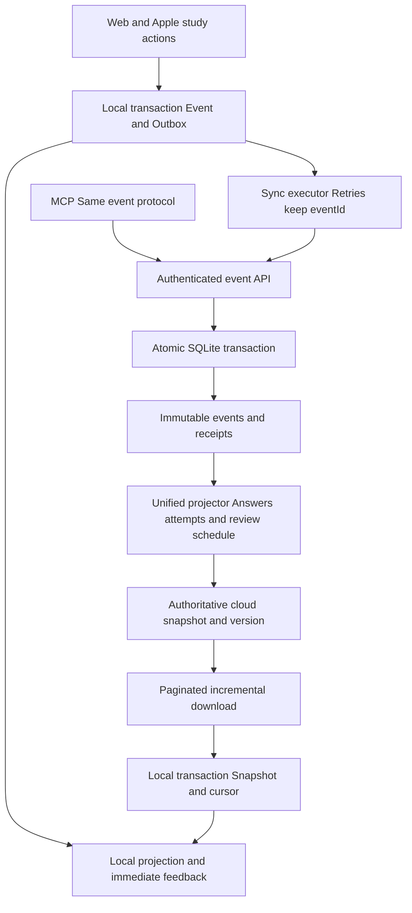
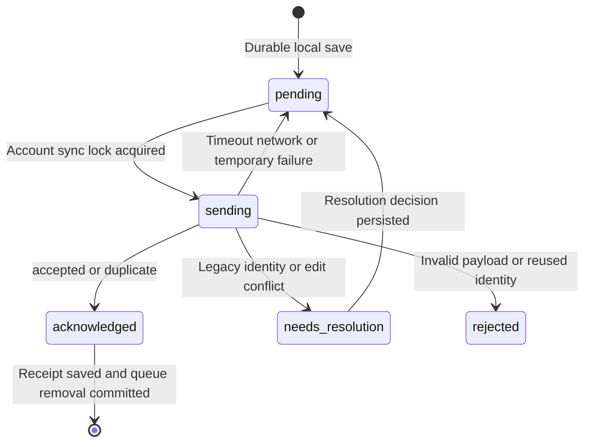

# Multi device study synchronization and conflict recovery architecture

Date: October 6, 2026. Status: architecture proposal with a targeted source repair; not deployed.

Languages: [中文](multi-device-study-sync-architecture.md) · English · [日本語](multi-device-study-sync-architecture.ja.md).

This document covers Web, iPhone, iPad, Mac Catalyst, and MCP writers in JLPT Master Deck. It explains the persistent conflict shown in the screenshot, defines a safe recovery process for existing records, and proposes an incremental synchronization protocol. **Upload immutable study events and calculate merged progress on the server. Local progress is a view that can be rebuilt.** Users should not have to choose which cumulative progress snapshot to overwrite.

Findings below come from repository source. The screenshot shows the installed client on October 5, 2026. The actual device queue, cloud account data, and deployed versions have not been inspected, so neither the exact triggering cloud operation nor recovery of the 100 records is verified.

## Why the conflict keeps returning

The screenshot reports refreshed cloud study data, 100 local answers awaiting upload, and a conflict for 葛飾区. It says the upload queue is paused and local records are preserved. Matching check and synchronization timestamps show that a synchronization step progressed; matching question counts do not prove that answers were uploaded.

For ordinary answers, the local queue stores `before` and `input.progressEntry`. Before upload, the client reads cloud progress and compares complete objects:

| Comparison | Current action | Limitation |
| --- | --- | --- |
| Cloud equals the local target | Treat as already applied and remove the operation | Equal state does not identify the same answer event |
| Cloud equals the local starting state | Upload the target snapshot | Another writer can change cloud state between the read and the write |
| Neither matches | Preserve the conflict | Retrying encounters the same mismatch without a merge protocol |

For example, both devices start with 10 correct answers. The phone answers correctly offline and stores a target of 11. The website records an incorrect answer, leaving 10 correct and 1 incorrect in the cloud. Both actions should survive. The phone only has an entire old snapshot to submit; downloading again does not rewrite the stored `before` into a safely merged operation.

Current `flushPending` skips conflicting operations, continues other operations, and reports conflicts at the end. This differs from the screenshot's queue-paused message. Check the installed build, source commit, and deployed service before treating current source behavior as a device fix. Later operations for the same item may depend on the conflicting predecessor, producing several dependent conflicts. The 100 pending records are not necessarily 100 independent conflicts.

## Existing foundations and gaps

| Component | Current source behavior | Architecture implication |
| --- | --- | --- |
| Native persistence | Per-account `study.json` contains the snapshot, pending queue, and responses; save before upload | Preserve existing data and migrate atomically |
| Ordinary answers | `/api/answers` replaces item progress with client-calculated `progressEntry`; latest answers are keyed by questionId | No ordinary answer event identity for reliable deduplication or concurrent merging |
| Subjective card ratings | `reviewEventId`, server deduplication, and replay over a baseline | Reuse this pattern across study actions |
| Mixed study actions | Ordinary answers clear the item's card replay baseline and event associations | A stale answer snapshot can still replace rating results; unify both paths |
| Attempt history | Native merging uses attemptId; incoming same-ID attempts replace previous attempts | Insufficient for concurrent editing of a shared attempt |
| Bulk practice updates | `savePracticeState` can delete and rebuild account answers and write progress snapshots | Close this bypass when introducing event projections |
| Web | IndexedDB caches downloaded snapshots; answers are sent directly; rating retry state uses an in-memory Map | Read caching does not provide a durable offline upload queue |
| Downloads | `/api/sync` uses a content-hash manifest, fixed paginated payloads, and deletion markers | Keep this protocol initially |
| Cloud storage | Worker → Durable Object SQLite, with R2 media and shared server logic | Use the existing transactional database |

Shared ordinary-answer logic transacts answers and progress, then saves attempt history separately. The cloud Worker also wraps requests in a transaction. Define a single business-level commit boundary for events, attempt results, projections, and receipts, so local SQLite and cloud behavior agree.

Native reading currently uses the `memory-card:` prefix with numeric selections. The client treats only four MemoryRating values as card ratings, while the server routes all answers with that prefix to rating persistence. Use explicit event types instead of inferring behavior from question IDs.

## Target architecture



Accepted cloud events are the source of truth. Progress, latest answers, attempt history, and statistics are derived views. Offline clients apply unacknowledged events over their last confirmed cloud view. Online clients reconcile receipts and adopt cloud projections. The system eventually converges; it does not promise immediate agreement while offline.

A general CRDT or additional message queue is unnecessary for the first phase. Study events merge as a set keyed by identity. Editable content and settings need revision handling. Media downloads remain independent of answer transactions.

## Data classes and merge rules

| Data | Rule | User action |
| --- | --- | --- |
| Objective answers and subjective ratings | Immutable events; deduplicate by account and eventId; retain distinct events | Usually none |
| Counts and progress | Rebuild on the server from a baseline and deduplicated events | No snapshot-overwrite choice |
| Repeated answers to one question | Retain each valid practice action; separately project the latest answer | Do not erase history by questionId |
| Completed attempts | Build from confirmed answers and completion events under attemptId | Old snapshots cannot revert completion |
| Active attempts | Independent attemptId per device by default; explicit takeover with revision for cross-device continuation | Branch or resolve concurrent edits to the same answer |
| Items, notes, exam targets, settings | Field PATCH with baseRevision; merge independent fields; return current values on same-field conflicts | Only unresolved edits require a choice |
| Deletion and progress reset | Versioned commands with tombstones or reset epochs | Confirm explicitly; old events cannot silently restore pre-reset state |
| Audio and images | Content versions and independent cache jobs | Failures do not block answers |

Objective accuracy and subjective ratings must remain separate. Existing mixed correct/wrong totals are compatibility fields, not objective accuracy. Mark unclassified legacy totals honestly rather than inventing historical events.

## Event and API contract

The following protocol is proposed, not implemented.

Each event includes `schemaVersion`, `eventId`, `deviceId`, persistent monotonic `deviceSeq`, `type`, `itemId`, `occurredAt`, and a business payload. Objective answers also retain attemptId, questionId, question revision, selection, original judgment, and elapsed time. Ratings retain rating. Derive userId from authentication.

```json
{
  "schemaVersion": 2,
  "eventId": "UUID generated on first local save",
  "deviceId": "installation UUID",
  "deviceSeq": 128,
  "type": "answer_recorded",
  "itemId": "place-katsushika-ku-20260922",
  "attemptId": "attempt UUID",
  "questionId": "question ID",
  "questionRevision": "revision or content hash",
  "occurredAt": "2026-10-05T14:09:00Z",
  "payload": { "selected": "B", "clientCorrect": true, "elapsedMs": 4300 }
}
```

1. Proposed `POST /api/study-events/batch` accepts small batches and returns eventId, status, reason, and committedVersion per event. Partial success is allowed. Statuses include accepted, duplicate, needs_resolution, rejected, and retryable temporary errors.
2. Enforce uniqueness on `(user_id, event_id)`. Same identity and semantic payload returns duplicate. A different payload under the same identity returns `EVENT_ID_REUSED` without replacing the original. Normalize fields and timestamps before calculating payloadHash.
3. Validate answers against the question revision and judge correctness on the server when possible. Preserve unavailable old revisions as legacy or unverified; do not blindly count client judgments as verified accuracy.
4. Atomically insert the event, update projections, persist its receipt, and advance the version. Database constraints and transactions resolve concurrent writes; client GET-then-POST checks cannot guarantee this.
5. After accepted or duplicate, locally transact receipt persistence, Outbox removal, and confirmed projection updates. If the response is lost or local persistence fails, resend the original eventId.
6. A batch receipt does not advance the full download cursor. Upload acknowledgement and download progress are separate.

Suggested tables: `study_events` for events and payload hashes; `study_outcomes` for server judgments; `study_projection_baselines` for migration starting points; `study_projections` for rebuildable results and reducerVersion; optional later `study_change_log` for versioned deltas; `legacy_import_receipts` for identity mapping and recovery decisions. Scope local Outboxes by backendOrigin and userId.

## Progress calculation and time

Count valid deduplicated events. Neither `max(local, cloud)` nor addition of cumulative snapshots is correct: taking the maximum loses independent increments, while adding snapshots duplicates shared history.

Use one versioned reducer for objective answers and subjective ratings. The same migration baseline and event set must produce the same projection. Persist the algorithm version and support rebuilds.

Keep client occurredAt, server receivedAt, and an effectiveAt fixed on first acceptance. Detect clock drift using a recent server-time anchor; retain the original timestamp, flag anomalies, and persist a corrected effective time when policy requires it. Retries cannot regenerate timestamps. Preserve deviceSeq and explicit causal dependencies first, then use effectiveAt and eventId for deterministic ordering. Unrelated cross-device events do not reveal an absolute real-world order.

Replay affected items when delayed offline events arrive. Do not use receive time as review time. Reconcile events older than the migration baseline before applying counts. For nearby “forgot” and “easy” ratings, the proposed product rule retains both events and selects an earlier review schedule, continuing the current conservative rating policy. Version and test this rule explicitly.

Initially rebuild only affected items. Later add checkpoints as history grows; delayed events require replay from a sufficiently early checkpoint, not merely adjustment of the final result.

## Local persistence and synchronization states

Web should atomically persist events, Outbox entries, and the display projection in IndexedDB. Native clients can first extend the atomic snapshot format, then move to SQLite to reduce large-file rewrites. Never show “saved” before durable queue persistence.



Use one executor per account. Foregrounding, manual sync, and network recovery trigger that executor. Web tabs need a shared lock or lease. Locks reduce duplicate requests; server identity guarantees deduplication. Use exponential backoff with jitter and honor Retry-After. A 401 pauses that account's requests without deleting its queue. Resume after login; expired sending states return to pending after a restart.

Isolate problematic records while unrelated items continue. Preserve dependencies for the same item, especially resets; do not skip a predecessor and conceal its failure with a later snapshot.

Retain fixed `/api/sync` pages and commit the complete downloaded records and cursor together. Failed pagination retains the old cursor. Separate the confirmed cloud view from the overlay of unacknowledged events. Acknowledged events not yet covered by a downloaded snapshot need a transitional layer until a snapshot watermark or explicit receipt linkage proves coverage. This prevents temporary disappearance and double counting.

Events created during download must remain in the latest Outbox. A stale copy of the queue must never replace it. Full downloads after cursor expiry rebuild only confirmed data and preserve unsent work.

## Recovering the existing 100 records

The current protocol lacks complete ordinary-answer identity and recovery. Refreshing the library may still work, but repeated synchronization does not merge the conflict. Preserve local data until recovery is available; do not uninstall, clear offline data, or replace the local queue with cloud data.

1. **Back up and verify identity.** Export the device's complete account snapshot, pending queue, responses, and attempts, plus cloud data. Record API origin, userId, client build, and service version. Keep private study exports outside the repository. Add an export entry point if needed.
2. **Produce a read-only recovery preview.** Classify ratings, answers, history-only operations, duplicate candidates, and invalid records. Group by item with before, target, cloud, and attempt details. Identify dependent blocked operations.
3. **Fix legacy identities.** Map ordinary queue UUIDs to stable legacy event IDs in `legacy_import_receipts`. Preserve existing rating reviewEventId values. Repeated migrations reuse these identities.
4. **Determine whether cloud totals already include each action.** Original event identity is strong evidence. Attempt, question, selection, original time, and revision support reconciliation; equal totals or nearby timestamps alone do not prove duplication. Keep ambiguous records for resolution.
5. **Persist baselines and decisions.** Separate “already counted, add history only” from “not counted, update the projection.” Do not add all old history to existing totals. Persist auditable decisions and keep uncertain originals rather than guessing and deleting them.
6. **Import and acknowledge atomically.** Insert definitely unsent events, supplement history without recounting baseline actions, rebuild affected projections, and return per-record receipts. Remove local pending entries only after receipts are durably saved.
7. **Verify each device.** Phone, iPad, and Web download the same projections. Check event identities, attempt outcomes, due dates, and unresolved records. Successful import and successful device download are separate acceptance steps.

Old requests may have committed while their responses were lost, without an event ledger. Some records cannot be automatically classified with certainty. Resolve each ambiguity once and persist the decision. Offer “same record” or “separate practice action,” rather than replacing an entire local or cloud dataset.

## Implementation phases

| Phase | Work | Acceptance |
| --- | --- | --- |
| P0 Diagnostics and preservation | Visible versions, export, per-record isolation, separate download/upload status, audit numeric reading routing | Explain the queue, preserve failed records, and let unrelated items proceed |
| P1 Unified server events | Ledger, receipts, reducer, batch API; answers, ratings, completion; close snapshot and bulk-replacement bypasses | Concurrent actions survive and retries count once in local SQLite and Worker |
| P2 Native and legacy migration | Apple Outbox, preview, stable mappings, atomic migration and acknowledgement | Every old operation has a durable state; restart and retries do not reimport |
| P3 Web and MCP parity | Durable Web queue, tab coordination, stable MCP identities, shared projections | Refresh and closing a tab preserve work; all writers converge |
| P4 Editing and operations | Field revisions, attempt takeover, reset/deletion semantics, optional version log and replay checkpoints | Edits are resolvable, offline records cannot undo resets, failures are traceable |

Deploy server capability before upgrading clients. Ordinary legacy snapshots without event IDs cannot be converted into reliably identified events by assumption. Use explicit recovery mode or require an upgrade while preserving local work. Block legacy snapshot writes from replacing event projections. Web can update centrally; installed clients need capability negotiation. Existing stable rating identities can use a defined adapter.

Rollback preserves the ledger, receipts, and migration backups. It may disable new ingress but must not restore unsafe snapshot replacement. Provide projection reconstruction or restoration. Media, identity, and content database migration are outside this change.

## Acceptance and observability

- Offline correct and online incorrect answers to the same item both survive.
- Repeated requests, lost responses, and failed local acknowledgement persistence count each event once.
- Different arrival orders for answers and ratings produce identical projections for the same event set.
- Multiple questions per item, early completion events, and cross-device takeover preserve dependencies and completion.
- Web refresh, tab closure, and concurrent tabs preserve and deduplicate work.
- Failed pages, expired cursors, new local work during sync, and snapshot lag do not lose or double-count events.
- 401, account switching, equal numeric IDs across different origins, and logout/login preserve account isolation.
- Clock drift, late events, unavailable revisions, deleted items, and resets have explicit outcomes.
- Repeated migration of the 100 old records yields stable identities and receipts; ambiguous duplicates stay visible.
- Reused IDs with different payloads are rejected; transaction failure leaves no partial event or projection, in both runtimes.

Show library update time, last successful upload, pending event count, unresolved count, and recent error separately. Example: “Library updated; 98 records synchronized, 2 legacy records need review. Records are saved on this device.” Derive counts from actual receipts.

Operational logs include eventId, device/protocol versions, request correlation, committed version, error code, retries, and oldest pending age, without tokens or full private study payloads. Monitor acceptance, duplication, unresolved records, projector duration, and download lag. Event identity and projection summaries provide stronger consistency evidence than library counts.

## Source references

- [Native queue and persistence](../apple/Sources/LocalStudyData.swift): `PendingAnswer.disposition`, `preservingLocalWork`, `recordingNativeBatch`.
- [Native upload](../apple/Sources/AppStore.swift): `saveAnswerLocally`, `flushPending`, `applyPending`.
- [Native models](../apple/Sources/Models.swift): `AnswerInput`, `NativeAttempt.merging`.
- [Answer and practice writes](../server/storage.mjs): `saveAnswer`, `saveCardReview`, `savePracticeState`.
- [Rating merge](../server/card-review-history.mjs): `insertCardReview`, `mergedCardProgress`.
- [Downloads](../server/study-sync.mjs), [Web cache](../src/lib/studySync.ts), [Web writers](../src/App.tsx), [API](../server/api-handler.mjs), [cloud transactions](../cloudflare/api-worker.mjs), [deployment configuration](../cloudflare/wrangler.api.json).

This document is a source-grounded architecture proposal. The targeted source repair is described below; complete implementation, real-account recovery, deployment, and device acceptance are not claimed.

## Scope of this repair

A targeted source change now addresses repeated retries at login. It has not been deployed or accepted on a real account device. The current-state analysis above describes the pre-change design; the complete architecture remains a proposal.

- New native ordinary answers persist a stable `syncEventId` and use the added `POST /api/answers/replay`. A server transaction merges current progress and saves `answer_replay_receipts`. Retries do not increment counts again; ordinary answers no longer use a client GET/compare/POST sequence.
- Legacy operations without the new identity are automatic only when cloud progress still equals before. Other states return needs_resolution, including equality with the old target, because matching state does not prove event identity.
- Legacy conflicts and dependent ordinary operations for the same item persist as records needing review. Login and foreground synchronization skip them while unrelated items and independent ratings continue. Local work is retained.
- The database check screen reviews records in order. A user can confirm that an answer was already counted, or that it is a separate practice action. The decision is saved locally first; the server preserves the original payload and receipt. Local queue removal follows durable acknowledgement.
- Numeric native reading selections use objective replay, rather than card-rating persistence. Delayed answers retain original time and add counts without rewinding a newer schedule. Older answers do not replace newer answers to the same question.
- New counters, review notices, and resolution actions have Chinese, English, and Japanese text.

This is not the full P1–P4 implementation. Durable Web Outboxes, migration of all write paths, deterministic replay of complete event sets, clock correction, reset epochs, and the proposed batch API remain future work. Existing Web/MCP snapshot writers still need migration, so universal conflict-free writes are not claimed. Update the backend before distributing the native client.
