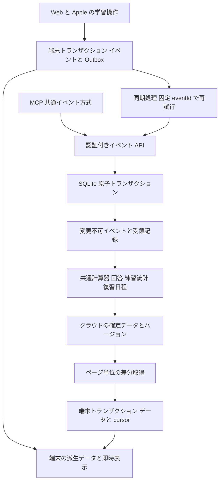
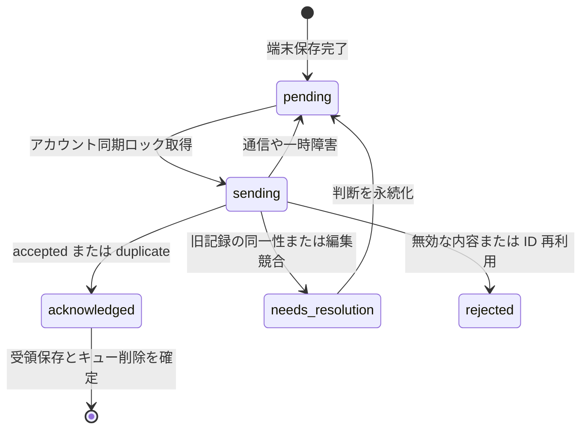

# 複数端末の学習データ同期と競合復旧の設計

日付：2026 年 10 月 6 日。状態：アーキテクチャ提案。全体の実装とデプロイは未完了。

言語：[中文](multi-device-study-sync-architecture.md) · [English](multi-device-study-sync-architecture.en.md) · 日本語。

本書は JLPT Master Deck の Web、iPhone、iPad、Mac Catalyst、MCP を対象に、画像の競合が繰り返される理由、既存記録の安全な復旧手順、段階的に導入する同期方式を説明する。**学習操作を変更不可のイベントとして送信し、サーバーで統合して進捗を計算する。端末の進捗は再構築できる表示用データとする。** 累積進捗のどちらを上書きするかを利用者に選ばせる方式は採用しない。

現状分析はリポジトリのソースコードに基づく。画像は 2026 年 10 月 5 日のインストール済みアプリの表示であり、実機の送信待ちデータ、クラウドの実データ、公開済みサービスのバージョンは未確認である。具体的な競合原因となった操作や、100 件の復旧完了は確認できていない。

## 競合が繰り返される理由

画像には、クラウドの学習データを更新した一方で、端末の解答 100 件が未送信であり、「葛飾区」の進捗が競合して送信キューを停止したこと、端末の記録を保持したことが表示されている。確認時刻と同期時刻が一致しても、解答の送信完了を意味しない。問題数の一致もデータ内容の一致を保証しない。

通常の解答キューは `before` と `input.progressEntry` を保存する。送信前にクラウドの進捗を取得し、オブジェクト全体を比較する。

| 比較結果 | 現在の処理 | 制約 |
| --- | --- | --- |
| クラウドが端末の更新後と一致 | 送信済みとみなしてキューから削除 | 状態の一致だけでは同一イベントと証明できない |
| クラウドが端末の更新前と一致 | 更新後の進捗を送信 | 取得と送信の間に別端末が更新できる |
| どちらとも一致しない | 競合記録を保持 | 統合方式がないため再試行しても同じ差異が残る |

両端末で正解 10 回の状態から、スマートフォンがオフラインで正解し、Web が不正解を記録した場合を考える。スマートフォンの目標は正解 11 回、クラウドは正解 10 回・不正解 1 回になる。両方の学習を残す必要があるが、現在の端末が送れるのは古い進捗全体である。再取得しても保存済み `before` が安全に統合されるわけではない。

現在の `flushPending` は競合した操作を飛ばし、他の操作を送信した後に競合を報告する。画像の「キューを停止」とは異なるため、アプリの build、ソースのコミット、サービスの公開バージョンを照合する。同じ項目の後続操作は前の進捗に依存し、連続して競合する可能性がある。未送信 100 件が独立した競合 100 件とは限らない。

## 既存の仕組みと不足点

| 対象 | 現在のソースの動作 | 設計への影響 |
| --- | --- | --- |
| ネイティブの保存 | アカウント別 `study.json` にスナップショット、pending、回答内容を保存してから送信 | 既存データを保持し、移行を原子的に行う |
| 通常の解答 | `/api/answers` が端末計算の `progressEntry` で進捗を置換。最新回答は questionId 単位 | イベント ID がなく、安全な重複排除と並行統合ができない |
| カードの自己評価 | `reviewEventId` による重複排除と基準進捗からの再計算 | 他の学習操作にも展開できる |
| 解答と自己評価の混在 | 通常の解答でカード再計算の baseline とイベント関連を削除 | 古い解答スナップショットが評価結果を上書きし得る |
| 練習履歴 | attemptId で統合するが、同じ ID の入力で既存値を置換 | 同一練習の複数端末編集には不十分 |
| 練習状態の一括保存 | `savePracticeState` が回答を削除・再構築し、進捗も更新できる | イベントを経由しない書き込みを閉じる必要がある |
| Web | IndexedDB はダウンロード済みデータを保存。解答は直接通信し、評価の再試行情報はメモリ Map | 読み取りキャッシュと永続的な送信キューは別機能 |
| ダウンロード | `/api/sync` は内容ハッシュ、固定ページ payload、削除マーカーを使用 | 初期段階はこの方式を維持できる |
| クラウド | Worker → Durable Object SQLite、メディアは R2、server の共通ロジックを利用 | 既存のトランザクションを活用する |

通常の解答の共通処理では回答と進捗がトランザクション内にあり、練習履歴は別途保存される。Worker には要求全体の外側のトランザクションもある。新方式ではイベント、練習結果、派生データ、受領記録を同じ業務上の原子処理にまとめ、ローカル SQLite とクラウドで保証を揃える。

ネイティブ読解の解答には `memory-card:` 接頭辞と数字の選択肢が使われている。端末は四つの MemoryRating だけをカード評価と判定するが、サーバーは接頭辞だけで評価保存に振り分ける。questionId の文字列ではなく、明示的なイベント種類で区別する。

## 目標構成



受け入れ済みのクラウドイベントを事実の基準とし、進捗、最新回答、練習履歴、統計は派生データとする。オフラインでは最後に確認したクラウドデータに未確認イベントを反映する。通信回復後は受領記録とクラウドの結果で整合させる。最終的に収束するが、オフライン中の即時一致は保証しない。

初期段階で汎用 CRDT や追加メッセージキューを導入する必要はない。学習イベントは ID をキーとする集合として統合できる。編集可能な資料や設定には版管理を用いる。音声と画像は解答とは独立して取得する。

## データ別の統合規則

| データ | 規則 | 利用者の操作 |
| --- | --- | --- |
| 客観的な解答と自己評価 | 不変イベント。アカウントと eventId で重複排除し、別イベントは両方保持 | 通常は不要 |
| 回数と進捗 | 基準値と重複排除済みイベントから再構築 | スナップショットの上書き選択は不要 |
| 同じ問題への再解答 | 有効な練習を毎回保持。最新回答は別途計算 | questionId だけで履歴を消さない |
| 完了した練習 | attemptId 内の確定回答と完了イベントから構築 | 古いデータで未完了に戻さない |
| 進行中の練習 | 原則として端末別 attemptId。複数端末で続ける場合は明示的な引継ぎと revision | 同じ問題の並行編集は分岐または競合処理 |
| 項目、メモ、目標、設定 | フィールド PATCH と baseRevision。独立フィールドは統合 | 同じフィールドの未解決競合だけ選択 |
| 削除と進捗リセット | バージョン付き命令と tombstone または reset epoch | 明示確認。古いイベントでリセット前に戻さない |
| 音声と画像 | 内容バージョンと独立キャッシュ処理 | 解答送信を妨げない |

客観的正答率と「覚えている」等の自己評価を分離する。既存の混合 correct/wrong は旧版互換値であり、正答率として扱わない。種類不明の累積値は旧データ未分類と表示し、架空のイベントを作らない。

## イベントと API

以下は提案であり、全体として実装済みの仕様ではない。

イベントには `schemaVersion`、`eventId`、`deviceId`、永続的に増加する `deviceSeq`、`type`、`itemId`、`occurredAt`、業務 payload を含める。解答には attemptId、questionId、問題の版、選択肢、元の判定、所要時間を保存する。自己評価には rating を保存する。userId は認証から決める。

```json
{
  "schemaVersion": 2,
  "eventId": "初回の端末保存時に生成した UUID",
  "deviceId": "インストール単位の UUID",
  "deviceSeq": 128,
  "type": "answer_recorded",
  "itemId": "place-katsushika-ku-20260922",
  "attemptId": "練習 UUID",
  "questionId": "問題 ID",
  "questionRevision": "問題の版または内容ハッシュ",
  "occurredAt": "2026-10-05T14:09:00Z",
  "payload": { "selected": "B", "clientCorrect": true, "elapsedMs": 4300 }
}
```

1. 提案する `POST /api/study-events/batch` は小規模な一括送信を受け、各イベントの eventId、状態、理由、committedVersion を返す。部分成功を許可する。状態は accepted、duplicate、needs_resolution、rejected と一時的な再試行可能エラー。
2. `(user_id, event_id)` を一意にする。同じ意味の payload は duplicate、異なる payload は `EVENT_ID_REUSED` とし、既存値を上書きしない。時刻とフィールドを正規化して payloadHash を計算する。
3. 問題の版から解答を検証し、可能な場合はサーバーで正誤判定する。旧版が取得できない場合は legacy または unverified として原記録を残す。端末の判定を無条件に正式正答率へ算入しない。
4. イベント、派生データ、受領記録、バージョンを同じトランザクションで更新する。並行書き込みは DB 制約で解決し、端末の GET 後 POST に依存しない。
5. accepted または duplicate の受信後、端末側も受領記録、Outbox の削除、確定データ更新を同じトランザクションで保存する。応答喪失や端末保存失敗時は元の eventId を再送する。
6. 送信の受領記録とダウンロード cursor は別管理にする。batch 応答だけでダウンロード cursor を進めない。

推奨テーブルは `study_events`、判定用 `study_outcomes`、移行基準の `study_projection_baselines`、計算結果と reducerVersion の `study_projections`、将来必要になった際の `study_change_log`、旧 ID と判断を残す `legacy_import_receipts`。端末の Outbox は backendOrigin と userId で分離する。

## 進捗計算と時刻

有効なイベントを重複排除して回数を算出する。`max(local, cloud)` は両端末の独立した増分を失い、累積値の加算は共通履歴を二重計上する。

通常の解答と自己評価を、同じ版の reducer で処理する。同じ移行基準とイベント集合から同じ結果を得ることを保証する。計算器の版を保存し、再構築を可能にする。

端末 occurredAt、サーバー receivedAt、初回受入時に固定する effectiveAt を保存する。最近のサーバー時刻との関係から時計のずれを検知し、元時刻を保持したまま異常を記録し、必要に応じて補正時刻を固定する。再送時に時刻を作り直さない。deviceSeq と明示的な因果関係を先に守り、effectiveAt と eventId で決定的に並べる。因果関係のない端末間操作の真の絶対順序は復元できない。

遅延イベントが届いたら該当項目を再計算する。受信時刻を復習時刻に置き換えない。移行基準以前のイベントは重複算入を防ぐため照合する。「忘れた」と「簡単」が短時間に並ぶ場合は両方を残し、より早い復習日を採用する保守的な規則を提案する。この製品規則は版とテストで明示する。

初期段階は影響した項目だけを再構築する。履歴が増えたらチェックポイントを追加する。遅延イベントは十分前のチェックポイントから再計算し、最後の結果への増分更新だけで処理しない。

## 端末保存と同期状態

Web は IndexedDB のトランザクションでイベント、Outbox、表示用データを一緒に保存する。ネイティブは既存の原子的なスナップショットを拡張し、将来は SQLite で大きなファイルの再書込みを減らす。「保存済み」と表示する前にキューを永続化する。



アカウントごとに同期処理を一つにし、前面復帰、手動同期、通信回復から起動する。Web の複数タブでは共有ロックまたはリースを使う。ロックは重複要求を減らし、重複排除そのものはサーバーが保証する。指数バックオフとランダムな待ちを使い、Retry-After に従う。401 はキューを残して通信を停止し、再ログイン後に再開する。再起動後は期限切れ sending を pending に戻す。

問題のある記録は別の待処理集合へ分離し、無関係な項目は送信する。同じ項目の依存関係やリセットは守り、後続スナップショットで前の失敗を隠さない。

`/api/sync` の固定ページを維持し、全 changes と cursor を端末で一緒に確定する。途中失敗は旧 cursor を保持する。confirmed と未確認イベントの overlay を分離する。送信済みでも取得スナップショットに未反映のイベントは、スナップショットの水位または受領 ID の対応で包含を確認するまで移行層に残す。これにより一時的な表示消失と二重計数を防ぐ。

ダウンロード中の新イベントは最新 Outbox に残す。開始時点の古いキューで置換しない。cursor 失効による全件取得も confirmed だけを再構築し、未送信記録を消さない。

## 既存の 100 件を復旧する手順

旧方式には通常解答の完全なイベント識別と復旧機能がない。教材の更新はできても、同期を繰り返すだけで競合は統合されない。復旧前にアンインストール、オフラインデータ削除、クラウドによるキュー置換を行わない。

1. **バックアップと本人確認。** 実機の完全な学習データ、pending、responses、練習履歴とクラウドデータを出力する。API origin、userId、build、サービス版を記録する。個人データはリポジトリに保存しない。必要なら先に出力機能を追加する。
2. **読み取り専用プレビュー。** 評価、解答、履歴補完、重複候補、無効記録を分類する。項目別に before、target、cloud、attempt を並べ、前の競合に依存する記録を明示する。
3. **旧 ID を固定。** 通常キューの UUID を安定した legacy eventId に対応付け、`legacy_import_receipts` に保存する。評価の reviewEventId はそのまま使う。再実行でも同じ ID とする。
4. **クラウドへの算入状況を照合。** 元 eventId が一致すれば強い根拠になる。attemptId、questionId、選択、元時刻、問題の版も使うが、累積値一致や近い時刻だけで重複と判断しない。不明な記録は確認対象として残す。
5. **基準と判断を保存。** 「算入済みで履歴だけ補完」と「未算入で進捗も更新」を区別する。旧履歴をすべて加算しない。不確かな記録を推測で削除せず、判断と原記録を残す。
6. **原子的に取り込む。** 未送信と確認したイベントを追加し、基準に含まれる回数を再加算せず履歴を補完する。該当進捗を再計算し、個別の受領記録を返す。端末は受領の保存後にだけ pending を削除する。
7. **各端末で確認。** スマートフォン、iPad、Web で同じ結果を取得し、ID、練習結果、復習日、待処理を確認する。サーバー取込成功と端末取得成功は別々に判定する。

旧要求はサーバー保存後に応答だけ失われた可能性があり、完全な台帳がないため自動判定できない記録がある。判断を一度行って保存する。「同じ解答」か「別の練習」かを確認し、端末全体・クラウド全体の上書きを求めない。

## 実装段階

| 段階 | 内容 | 完了条件 |
| --- | --- | --- |
| P0 診断と保全 | 版表示、出力、個別分離、送受信状態の分離、数字読解ルートの確認 | キュー構成を説明でき、無関係な記録を送信できる |
| P1 サーバー共通イベント | 台帳、受領、計算器、batch API。解答・評価・完了を対象に旧置換経路を閉じる | 並行学習を保持し、両 DB 実装で再送を一回だけ計数 |
| P2 ネイティブと旧記録移行 | Outbox、確認画面、ID 対応、原子的移行 | 全操作に状態があり、再起動で重複取込しない |
| P3 Web と MCP | 永続キュー、タブ協調、固定 ID、共通計算結果 | 更新・タブ終了後も記録が残り、全端末が収束 |
| P4 編集と運用 | フィールド版、練習引継ぎ、削除・リセット、必要に応じ版ログとチェックポイント | 編集競合を処理でき、旧操作がリセットを取り消さない |

サーバー機能を先に公開し、各端末を更新する。ID のない旧スナップショットを、根拠なく安全なイベントに変換しない。復旧モードまたは更新要求を返し、本機記録を保持する。旧 API が新しい派生データを上書きすることを禁止する。Web は一括更新できるが、インストール済みアプリは能力確認が必要。評価は既存の固定 ID を使う互換規則を設ける。

ロールバックしてもイベント台帳、受領、移行バックアップを残す。新 API の受付停止は可能だが、旧スナップショットの危険な置換を再開しない。派生データの再構築・復元機能を用意する。メディア、認証、教材 DB の移行は今回の対象に含めない。

## 検証と監視

- 同じ項目へのオフライン正解とオンライン不正解を両方保持する。
- 再送、応答喪失、端末受領保存失敗で計数は一回だけとなる。
- 解答と評価の到着順を変えても同じ集合から同じ結果になる。
- 同項目の連続問題、完了先着、端末間引継ぎで回答を失わず完了状態を戻さない。
- Web 更新、タブ終了、複数タブでもキューが残り重複排除される。
- ページ取得失敗、cursor 失効、同期中の新解答、スナップショットの遅れで欠落・二重計数しない。
- 401、アカウント切替、origin の異なる同じ数値 ID、再ログインでも隔離される。
- 時計のずれ、遅延、旧問題版の欠落、削除、リセットを明示的に処理する。
- 100 件の移行を再実行しても ID と受領は安定し、不明な重複は確認対象に残る。
- 同 ID・異なる内容を拒否し、トランザクション失敗で半端な保存を残さない。両実行環境で検証する。

同期画面では教材更新時刻、最終送信成功、未送信数、要確認数、最近のエラーを分ける。例：「教材を更新しました。98 件を同期し、旧記録 2 件は確認が必要です。記録は端末に保存されています。」数字は実際の受領から計算する。

ログには eventId、端末・方式の版、要求 ID、確定版、エラー、再試行数、最古 pending の経過時間を残す。トークンや私人の学習内容全体は記録しない。成功率、重複率、要確認数、計算時間、取得遅延を監視する。教材数の比較よりイベント ID と計算結果の要約が一致の根拠になる。

## ソース参照

- [端末キューと保存](../apple/Sources/LocalStudyData.swift)：`PendingAnswer.disposition`、`preservingLocalWork`、`recordingNativeBatch`。
- [端末送信](../apple/Sources/AppStore.swift)：`saveAnswerLocally`、`flushPending`、`applyPending`。
- [データ型](../apple/Sources/Models.swift)：`AnswerInput`、`NativeAttempt.merging`。
- [解答と練習の保存](../server/storage.mjs)：`saveAnswer`、`saveCardReview`、`savePracticeState`。
- [カード統合](../server/card-review-history.mjs)：`insertCardReview`、`mergedCardProgress`。
- [差分取得](../server/study-sync.mjs)、[Web キャッシュ](../src/lib/studySync.ts)、[Web 書き込み](../src/App.tsx)、[API](../server/api-handler.mjs)、[クラウド処理](../cloudflare/api-worker.mjs)、[公開設定](../cloudflare/wrangler.api.json)。

本書はソースに基づく設計提案であり、全体の実装、実データ復旧、公開、実機検証の完了を意味しない。

## 今回の修正範囲

ログイン時に同じ記録を繰り返し送信する問題への対策をソースに実装した。公開と実アカウントの端末検証は未完了である。上記の現状分析は改修前の設計を記録し、完全な目標構成は今後の提案として残る。

- ネイティブの新しい通常解答は固定 `syncEventId` を保存し、新設 `POST /api/answers/replay` を使う。サーバーは現在の進捗との統合と `answer_replay_receipts` の保存を同じトランザクションで行う。再送で回数を増やさず、通常解答の端末 GET・比較・POST を廃止する。
- 新 ID のない旧記録はクラウドが before と一致する場合だけ自動処理する。それ以外は needs_resolution とし、旧 target と一致する場合も同一操作だと推測しない。
- 旧競合と同項目の依存する通常解答を要確認として永続化する。ログイン・前面復帰では再送せず、無関係な項目や独立したカード評価は送信を続ける。端末の記録は保持する。
- データベース確認画面で順番に一件ずつ確認できる。利用者は算入済みとして記録を残すか、別の練習として加算するかを選ぶ。判断を先に端末へ保存し、サーバーも原 payload と受領を保存する。受領を端末へ保存してからキューを削除する。
- 数字で選択するネイティブ読解はカード評価ではなく通常解答 replay を使う。遅延解答は元時刻と回数を保持し、新しい復習日程を巻き戻さない。古い回答は同じ問題の新しい回答を上書きしない。
- 新しい件数、要確認表示、確認操作には中国語・英語・日本語を追加した。

P1–P4 全体の実装ではない。Web 永続 Outbox、全書込経路の移行、全イベント集合からの到着順に依存しない再計算、時計補正、reset epoch、batch API は未実装。Web/MCP の旧スナップショット書込みも残るため、全端末の競合解消を保証したとは述べない。ネイティブ配布より先にバックエンドを更新する。
