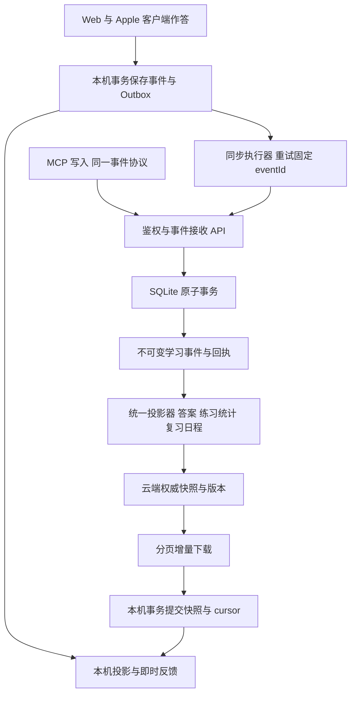
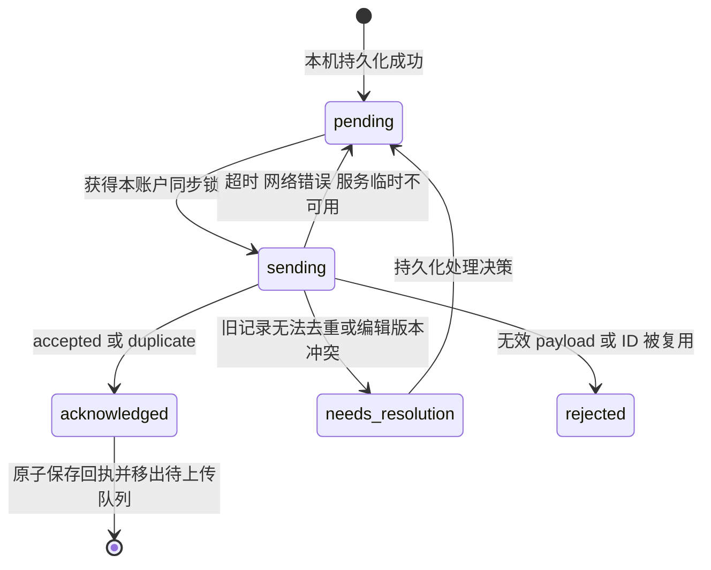

# 多端学习数据同步与冲突恢复架构

> **已被 schema v3 取代。** 本文描述 v3 之前的数据模型或接口，保留作历史参考。当前结构见 [schema-v3-design.md](schema-v3-design.md)，接口与 MCP 见 [local-backend-mcp.md](local-backend-mcp.md)。

日期：2026 年 10 月 6 日。状态：架构提案，已完成局部源码修复，尚未部署。

语言：中文 · [English](multi-device-study-sync-architecture.en.md) · [日本語](multi-device-study-sync-architecture.ja.md)。

本文面向 JLPT Master Deck 的 Web、iPhone、iPad、Mac Catalyst 与 MCP 写入端，解释截图中的冲突为什么持续存在，规定旧记录的安全恢复路径，并提出可逐步落地的同步协议。结论是：**学习行为应以不可变事件上传，云端统一合并并计算进度；本机进度是可重建的显示结果。** 不应继续要求用户在两份累计进度之间选择覆盖。

以下现状来自当前仓库源码。截图反映已安装客户端在 2026 年 10 月 5 日的提示；未读取该设备的真实队列、云端账户数据或已部署服务版本，因此不能断言具体哪条云端操作造成了冲突，也不能声称这 100 条记录已经恢复。

## 这次冲突为什么重复出现

截图显示：题库检查已更新，本机仍有 100 条答题记录待上传，「葛飾区」的云端进度与本机待上传记录冲突，上传队列暂停，本机记录保留。云端检查时间与本机同步时间相同，只说明某次同步流程推进了；题目数量相同也只说明数量一致，不能证明答题已上传。

当前普通答题的本机队列保存 `before` 和 `input.progressEntry`。上传前读取云端进度，再按完整对象相等判断：

| 比较结果 | 当前处理 | 局限 |
| --- | --- | --- |
| 云端等于本机目标进度 | 认为已上传，移除队列记录 | 状态相等不能证明是同一条答题事件 |
| 云端等于本机作答前进度 | 上传本机目标进度 | 检查与上传是两个请求，中间另一端仍可写入 |
| 两者都不相等 | 保留冲突记录 | 缺少合并协议，下一次重试仍会遇到相同差异 |

示例：两端都从答对 10 次开始；手机离线答对一次，保存目标 11 次；网页答错一次，云端变成答对 10 次、答错 1 次。两次学习都有效，正确结果应同时保留。手机却只能提交整份旧快照，既不能直接覆盖，也不能靠再下载自动修复其已保存的 `before`。

当前 `flushPending` 已跳过冲突操作并继续处理其他操作，最后汇总冲突；与截图“上传队列已暂停”的文案存在差异。需要核对安装包 build、源码提交和服务部署版本，不能把当前源码行为当成设备上已经生效的修复。同一词条后续操作依赖前序进度，前序冲突还可能使后续多条记录连续冲突；100 条是待上传总数，不等于 100 条独立冲突。

## 当前系统有哪些基础与缺口

| 环节 | 当前源码行为 | 对架构的影响 |
| --- | --- | --- |
| 原生本机保存 | 按账户保存 `study.json`，包含学习快照、pending 和作答内容；先持久化再上传 | 保留现有数据，升级须原子迁移 |
| 普通答题 | `/api/answers` 接收客户端算好的 `progressEntry`，覆盖该词条进度；答案按 questionId 保存最新值 | 没有普通答题事件身份，不能安全去重或合并并发学习 |
| 主观卡片评分 | 有 `reviewEventId`；服务端按事件去重，并从 baseline 重放评分 | 可复用事件模式，但尚未覆盖所有学习行为 |
| 混合学习 | 普通答题写入会清掉该词条的卡片重放 baseline 和事件关联 | 陈旧答题快照仍可能覆盖评分结果，两个合并路径必须统一 |
| 练习历史 | 原生按 attemptId 合并；同 ID 的传入练习直接替换旧练习 | 不能作为同一练习跨端并发编辑的完整合并规则 |
| 练习状态批量保存 | `savePracticeState` 可删除并重建账户答案，亦可写入进度快照 | 新协议不能留下这条绕过事件投影的写入入口 |
| Web | IndexedDB 保存下载快照；答题直接发送网络请求，卡片待重试信息在内存 Map 中 | 已有读取缓存不代表有持久、可靠的离线上传队列 |
| 下载协议 | `/api/sync` 使用内容哈希 manifest、分页固定 payload、删除标记；Web 完整下载后保存 | 可先沿用，无须为了上传改造立即重写下载 |
| 云端存储 | 配置为 Worker → Durable Object SQLite，媒体使用 R2；共享 server 业务代码 | 利用现有 SQLite 事务，不引入第二套云端学习库 |

普通 `/api/answers` 在共享业务代码中把答案与进度放入事务，练习历史另行保存；云端 Worker 还有外层请求事务。新协议仍需在业务层明确“事件、练习结果、投影、回执”的同一原子提交边界，确保本地 SQLite 与云端实现一致。

另一个边界问题：原生阅读作答目前使用 `memory-card:` 前缀，但 selected 是数字；上传分支仅把四种 MemoryRating 识别为评分，而服务端按前缀进入评分保存。协议应明确区分事件类型，不能靠 questionId 前缀推断行为。

## 目标架构



云端事件集合是已接收学习行为的事实来源；进度、最新答案、练习历史和统计是派生视图。离线时本机在最后确认的云端视图上应用未确认事件，保持可用；联网后根据回执消除本机未确认事件，再采用云端结果。数据最终收敛，离线期间不承诺各端即时一致。

无需第一阶段引入通用 CRDT 或额外消息队列。学习事件天然可按 ID 做集合合并；真正需要版本冲突处理的是可编辑资料和设置。媒体文件继续走独立下载与缓存，不进入答题事务。

## 数据分类与合并规则

| 数据 | 规则 | 是否需要用户处理 |
| --- | --- | --- |
| 客观答题、主观评分 | 不可变事件，按账户与 eventId 去重，不同事件均保留 | 通常不需要 |
| 计数与学习进度 | 云端依据基线与去重事件重建 | 不需要选择覆盖 |
| 同一题多次作答 | 每次有效练习保留；最新答案单独投影 | 不按 questionId 删除历史 |
| 已完成练习 | 从 attemptId 下的题目确认事件及完成事件构建 | 不允许旧快照把完成改回未完成 |
| 正在进行的练习 | 默认每端独立 attemptId；跨端继续使用显式接管与 revision | 同题并发修改时展示分支或冲突 |
| 词条、笔记、学习目标、设置 | 按字段 PATCH 与 baseRevision；独立字段可合并，相同字段冲突返回最新值 | 仅无法自动合并的编辑需要选择 |
| 删除与重置进度 | 带版本的显式命令与 tombstone 或 reset epoch | 明确确认，旧离线事件不得自动复活重置前状态 |
| 音频与图片 | 内容版本与独立缓存任务；失败独立重试 | 不阻塞答题上传 |

统计须区分客观答题正确率与主观“记住了”评分。现有 correct/wrong 混合计数只能作为旧版兼容字段，不能直接当作答题正确率。历史累计值缺少类型信息时明确标记“旧数据未分类”，不虚构事件。

## 事件与接口契约

以下均为拟新增协议，不是已实现接口。

事件至少包含 `schemaVersion`、`eventId`、`deviceId`、持久递增的 `deviceSeq`、`type`、`itemId`、`occurredAt` 和业务 payload。客观答题另外保存 attemptId、questionId、题目版本、所选答案、原始判定与耗时；评分保存 rating。userId 由鉴权决定，不信任客户端指定。

```json
{
  "schemaVersion": 2,
  "eventId": "由客户端首次保存时生成的 UUID",
  "deviceId": "安装实例 UUID",
  "deviceSeq": 128,
  "type": "answer_recorded",
  "itemId": "place-katsushika-ku-20260922",
  "attemptId": "练习实例 UUID",
  "questionId": "题目 ID",
  "questionRevision": "题目版本或内容哈希",
  "occurredAt": "2026-10-05T14:09:00Z",
  "payload": { "selected": "B", "clientCorrect": true, "elapsedMs": 4300 }
}
```

1. `POST /api/study-events/batch` 接收小批量事件。每条返回 eventId、状态、原因和 committedVersion；允许部分成功。状态包括 accepted、duplicate、needs_resolution、rejected，以及可重试的临时错误。
2. 唯一键为 `(user_id, event_id)`。同 ID、同语义 payload 返回 duplicate；同 ID、不同 payload 返回 `EVENT_ID_REUSED`，不覆盖原事件。规范化时间和字段后计算 payloadHash。
3. 使用题目版本校验作答；可验证时由服务端判断正确与否。无法找到旧题版本时保留原始记录并标注 legacy 或 unverified，不能直接信任客户端计入正式正确率。
4. 事务中写入事件、更新投影、生成回执和递增版本，全部成功后才响应。并发写入必须以数据库约束和事务解决，不能先 GET 再由客户端判断可写。
5. 客户端收到 accepted 或 duplicate 后，在同一本机事务内保存回执、移出 Outbox、更新已确认投影。响应丢失或本机保存失败，重发原 eventId。
6. batch 响应只确认提交版本，不能直接推进完整下载 cursor。上传回执与下载游标是两个独立进度。

建议表：`study_events` 保存事件与 payloadHash；`study_outcomes` 保存服务端判定；`study_projection_baselines` 保存迁移起点；`study_projections` 保存可重建结果与 reducerVersion；`study_change_log` 在后续规模需要时提供版本增量；`legacy_import_receipts` 保存旧记录映射与去重决策。Outbox 位于各端本机，按 backendOrigin 与 userId 隔离，避免本地环境和生产账户碰撞。

## 进度计算与时间处理

计数按有效、去重事件累计，不使用 `max(local, cloud)`，也不把两份累计快照直接相加。例如两端分别多答对一次，取最大值会少算一次；直接相加则会重复计算共同的历史。

排程由统一版本的 reducer 计算：同一迁移基线与同一事件集合必须得到同一结果。客观答题和主观评分都进入该 reducer，避免另一条接口直接覆盖结果。算法版本写入投影，升级后可重建。

时间至少保存客户端 occurredAt、服务端 receivedAt 和首次接收时固定的 effectiveAt。设备时间不可信：通过最近一次服务器时间锚点检测偏差，超出策略范围的事件保留原时间，使用固定的校正时间并标记异常。重试不能重新生成时间。排序须先保持同设备 deviceSeq 与明确因果依赖，再按 effectiveAt 和 eventId 做确定性排序；跨端无因果关系时无法恢复绝对真实顺序，应承认这一限制。

迟到的离线事件进入完整事件集合后，重放受影响词条，不能简单把 receivedAt 当最后复习时间。迁移基线以前的旧事件要经过恢复核对，防止重复算入。近时间“忘记了”和“很简单”的排程建议延续现有评分器的保守策略：保留两次评分，短窗口内采用更早复习安排；这是产品规则，实施时须写入 reducer 的明确版本和用例。

完整重放成本随词条事件增长；第一阶段限定按受影响词条重建，后续再增加检查点。加入迟到事件时，从足够早的检查点重放，不能只增量修改最后一个结果。

## 本机保存与同步状态机

Web 使用 IndexedDB 事务同时保存事件、Outbox 和显示投影；原生可先扩展现有原子快照格式，长期采用 SQLite 事务以降低大快照写入成本。不得在用户看到“已保存”后才异步补写队列。



每账户单一同步执行器，前台恢复、手动同步和网络恢复只触发执行器；Web 多标签页需共享锁或租约。锁只能减少重复请求，真正去重仍在服务端。指数退避加随机抖动；限流遵循 Retry-After；401 暂停本账户网络请求并保留队列，登录后继续；进程退出后过期的 sending 恢复为 pending。

问题记录进入独立待处理集合，其他词条继续上传。同词条存在业务依赖时，在依赖解决前等待，不能越过重置命令或用后序快照掩盖前序失败。

下载沿用 `/api/sync` 固定分页 payload：先收集完整 changes，再在本机事务内一起提交 records 和 cursor；分页失败保持旧 cursor。云端快照是 confirmed 层，未确认事件是 overlay 层，界面由两者计算，不能混成一份无法辨认来源的 progress。已获回执、尚未包含在下载快照中的事件需要保留过渡层；以快照水位或明确事件回执关联确认覆盖后才移除，防止先消失后出现或重复计数。

同步时新产生的事件必须留在最新 Outbox，不能被开始下载时截取的旧队列覆盖。旧 cursor 失效后的全量下载也只重建 confirmed 层，不能清掉本机未确认事件。

## 现有 100 条记录如何恢复

当前版本没有完整的普通答题事件去重与恢复协议。用户可继续使用保留本机记录的同步入口刷新题库，但重复点同步不能完成冲突合并。修复前不要卸载应用、清除离线数据或用云端覆盖本机队列；本机未上传记录可能只存在该设备上。

实施恢复时按以下步骤执行，不直接改写累计进度：

1. **备份并核对身份。** 从当前设备导出完整账户学习快照、pending、responses 与练习历史，同时导出云端数据。记录 API origin、userId、客户端 build 和服务版本；备份放账户私有导出目录，不提交个人答题数据到仓库。当前缺少导出入口时先实现入口。
2. **生成只读恢复预览。** 展示 100 条队列中的评分、答题、历史补录、重复候选及无效记录数量；按词条分组列出 before、target、cloud 和对应 attempt。明确哪些条目只是被前序冲突连带阻塞。
3. **固定旧记录身份。** 普通队列 UUID 映射为稳定 legacy eventId，映射写入 `legacy_import_receipts`。评分已有 reviewEventId 时保留原 ID，不额外造一个事件。重跑迁移仍用同一身份。
4. **核对是否已计入云端。** 有相同原始 eventId 的记录直接确认；attemptId、questionId、所选答案、原始时间和题目版本可帮助核对，但累计进度相等或时间相近不能单独证明重复。缺少强身份的记录进入待确认分类。
5. **保存迁移基线与处理决策。** 云端现有累计值已包含部分旧行为，不能把全部旧历史再加一次。区分“已包含，只补事件历史”和“未包含，需要增加投影”，每条决定可追溯并保证重复导入不增加计数。无法判断时先保留原始历史和不确定状态，等待核对，不能猜测后删除本机记录。
6. **兼容导入并原子确认。** 对确定未上传的学习行为写入事件；补齐历史但不重复应用基线内的计数；重建受影响投影，返回逐条回执。本机持久保存回执后才清除对应 pending。
7. **多端复核。** 手机、iPad、网页拉取同一云端投影，核对事件身份、练习结果、到期日和剩余待处理列表。导入成功不等于设备已经下载成功，两者分别验收。

旧协议有“云端提交成功但响应丢失”的窗口，也缺少完整事件账本，因此未必能全自动判断每条历史是否已包含。这类记录只需处理一次并保存决策；恢复界面提供“确认是同一次记录”或“确认为另一轮练习”，而不是让用户选择覆盖整个云端或整个本机。

## 分阶段实施

| 阶段 | 工作 | 完成条件 |
| --- | --- | --- |
| P0 可诊断与保全 | 安装与服务版本可见；导出备份；冲突逐条隔离；内容下载与事件上传状态分开；审核阅读数字评分路由 | 能解释 100 条队列组成，失败记录不丢失且不阻塞无关词条 |
| P1 服务端统一事件 | 事件表、回执、统一 reducer、batch API；覆盖普通答题、评分及练习完成；封住进度快照与整表答案替换入口 | 两端并发学习均保留，重复请求不多计，SQLite 与 Worker 行为一致 |
| P2 原生与旧队列迁移 | Apple 新事件 Outbox；恢复预览、legacy 映射、原子迁移与回执 | 旧数据有备份，每条旧操作有明确状态，重启与重试不重复导入 |
| P3 Web 与 MCP 一致 | Web 持久 Outbox、多标签页同步锁；MCP 使用稳定事件 ID；所有入口使用同一投影 | 网页刷新或关闭后离线记录仍在，各写入端结果收敛 |
| P4 编辑与运维完善 | 设置字段 revision、跨端练习接管、删除重置语义；按规模引入版本日志与重放检查点 | 编辑冲突可处理，重置不会被旧离线数据撤销，可追踪异常 |

服务端先上线协议能力，再升级各端。普通旧客户端缺少事件 ID 时，不能把它的快照自动伪装成可靠事件：进入明确的兼容恢复模式，或对旧学习写入返回“需升级”并保留本机数据。新旧写入并行时，禁止旧接口覆盖事件投影；Web 可整站同步升级，已安装原生端需能力协商。卡片旧协议已有稳定评分身份，可按明确适配规则迁移。

回滚保留事件账本、回执与迁移备份；可停用新入口，不能恢复旧快照覆盖权限。提供按事件重建或恢复投影的管理能力。没有必要在这次改造同时迁移媒体、认证或题库数据库。

## 验收场景与可观测性

必须通过以下场景，才能宣称多端学习同步问题已解决：

- 手机离线答对、网页在线答错同一词条，联网后两条事件都在，计数与历史无覆盖。
- 相同事件重发多次、服务端提交后响应丢失、本机保存回执失败，最终均只计一次。
- 两端评分与普通答题交错到达，换一组上传顺序后，同一事件集合得到相同投影。
- 同一词条连续多题、完成事件先到、跨端接管练习，依赖处理不丢题，完成状态不回退。
- Web 作答后关闭标签页、刷新、多标签页重复执行同步，队列可恢复且去重正确。
- 分页下载失败、快照过期、同步时新增本机事件、上传已确认但快照尚未追上，界面不重复计数且不丢未确认记录。
- 401、切换账户、生产与本地同数字 userId、退出再登录，队列严格隔离。
- 设备时间偏差、迟到事件、旧题版本不可用、词条删除、进度重置，处理结果明确且可解释。
- 旧 100 条队列重复运行迁移，回执与事件数量稳定；不确定重复只进入待处理列表。
- 同 ID 不同 payload 拒绝；服务端事务中途失败不留半条事件或半份投影；Worker 和本地 SQLite 均验证。

同步页面分别显示：题库更新时间、最后成功上传时间、待上传事件数、待处理记录数与最近错误。示例文案：“题库已更新；98 条记录已同步，2 条旧记录需要核对，记录已保存在本机。”数字须来自实际回执，不能根据队列长度减少直接推断成功。

运维记录 eventId、设备与协议版本、请求关联 ID、提交版本、错误码、重试次数和最老 pending 年龄；不记录访问令牌与完整私人学习内容。监控接收成功率、重复率、待处理数量、投影耗时与下载延迟。比较事件身份和投影摘要比比较题库总数更能证明同步一致。

## 源码依据

- [原生队列判断与本机保存](../apple/Sources/LocalStudyData.swift)：`PendingAnswer.disposition`、`preservingLocalWork`、`recordingNativeBatch`。
- [原生上传与冲突隔离](../apple/Sources/AppStore.swift)：`saveAnswerLocally`、`flushPending`、`applyPending`。
- [原生数据模型](../apple/Sources/Models.swift)：`AnswerInput` 与 `NativeAttempt.merging`。
- [普通答题与练习状态写入](../server/storage.mjs)：`saveAnswer`、`saveCardReview`、`savePracticeState`。
- [卡片事件合并](../server/card-review-history.mjs)：`insertCardReview`、`mergedCardProgress`。
- [现有下载同步](../server/study-sync.mjs) 与 [Web 缓存](../src/lib/studySync.ts)。
- [Web 写入入口](../src/App.tsx)、[共享 API](../server/api-handler.mjs)、[云端事务](../cloudflare/api-worker.mjs) 与 [云端部署配置](../cloudflare/wrangler.api.json)。

本文的目标架构仍是实施方案；本次局部源码修复见下节。未操作真实账户记录，未完成部署或设备端恢复验收。

## 本次修复范围

本次已在源码中实现针对重复登录重试的修复，尚未部署或在真实账户设备上验收。上文的现状分析记录的是改造前的设计问题，完整目标架构仍是后续方案。

- 原生新普通答题保存固定 `syncEventId`，使用新增 `POST /api/answers/replay`，服务端在同一事务中合并当前进度并保存 `answer_replay_receipts`。重试不会重复增加次数；不再执行客户端 GET 后比较再 POST 的普通答题链路。
- 没有新事件 ID 的旧队列，只有云端仍等于 before 时才自动处理；其他情况返回 needs_resolution，包括云端恰好等于旧 target 的情况，避免用状态相等猜测同一次作答。
- 旧冲突及依赖它的同词条普通操作持久保存为待核对，自动登录与前台同步不再重复尝试这些记录，其他词条及独立卡片事件继续上传。没有删除本机数据。
- 数据库检查页按顺序核对单条记录。用户可确认“已包含，只保留记录”或“另一轮练习，合并计数”。判断先保存到本机；服务端保留原 payload 和受领记录，本机保存成功后才移出队列。
- 数字选择的原生阅读解答走普通答题 replay，而非卡片评分。迟到解答保留原作答时间，增加次数但不倒退较新的复习日程；旧答案不替换较新的同题答案。
- 新增的计数、待核对提示和核对操作提供中文、英文和日文文案。

这次修复不是完整 P1 到 P4 的落地：Web 持久 Outbox、所有写入入口统一、按完整事件集合重放以保证任意到达顺序一致、时钟校正、reset epoch 和 batch API 仍未实现。现有 Web/MCP 的旧快照入口仍需后续迁移，因此不宣称所有多端写入已无冲突。后端服务须先更新，再分发原生新版本。
